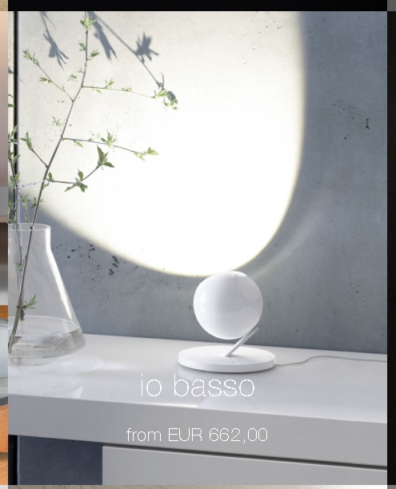
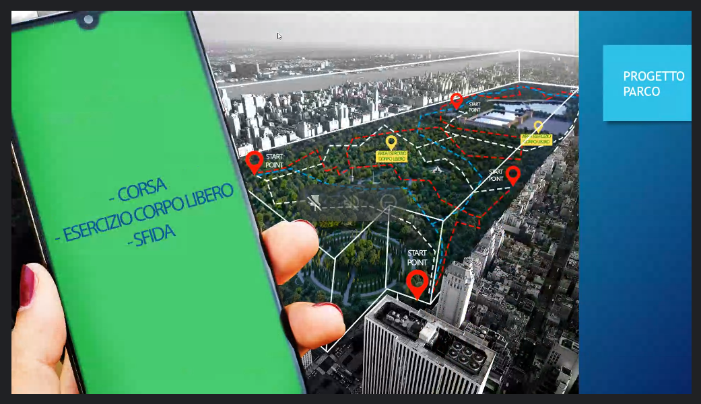
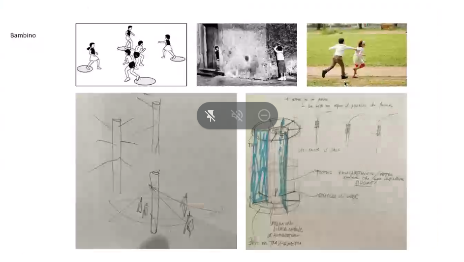

# Revision 220110

## Project 1 - Light+Project Mapping

## Project 2 - Sport App + Infrastructure

## Project 3 - Drones

## Reference

[Occhio](https://www.occhio.de/en/adjustable-light-color)  
[Beacon Museum](images/Revision_220110/p1_0000.png)  
[Targetti](https://www.targetti.com/en)  
[How drones could reshape cities](https://www.fastcompany.com/90528968/how-drones-could-reshape-cities?partner=rss&utm_source=rss&utm_medium=feed&utm_campaign=rss+fastcompany&utm_content=rss?cid=search)  
[Cyber Physical Macro Material](https://www.icd.uni-stuttgart.de/teaching/master-theses/cyber-physical-macro-material-as-a-uav-reconfigurable-architectural-system/)  
[This onion-shaped sculpture is actually a delivery drone launch station](https://www.fastcompany.com/90472907/this-onion-shaped-sculpture-is-actually-a-delivery-drone-launch-station?partner=rss&utm_source=rss&utm_medium=feed&utm_campaign=rss+fastcompany&utm_content=rss?cid=search)  
[This tiny drone with a tiny brain is smart enough to fly itself](https://www.fastcompany.com/40575392/this-tiny-drone-with-a-tiny-brain-is-smart-enough-to-fly-itself?cid=search)  
[Bit Craze](https://www.bitcraze.io/)  
